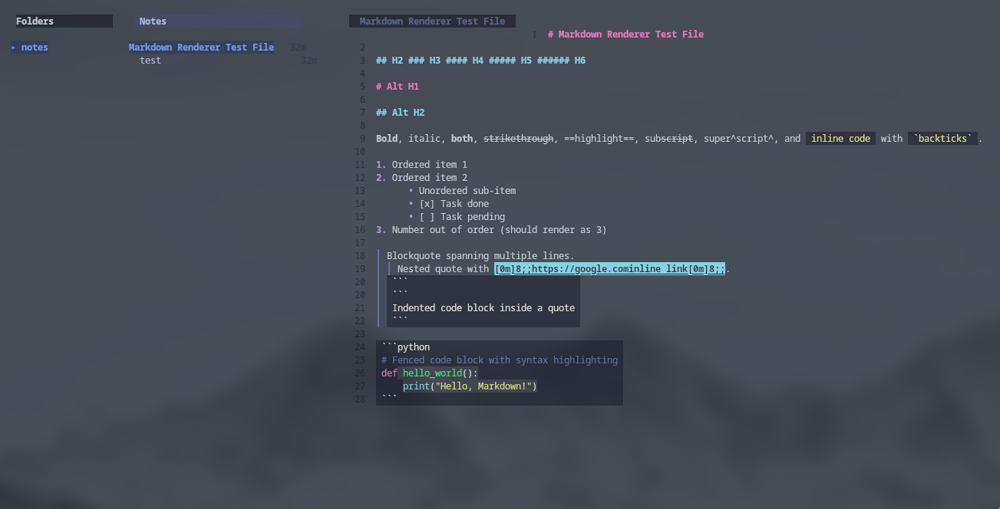

<p align="center">
  
</p>

<p align="center">
  <a href="https://github.com/psychosomat/Clio/releases"></a>
  <a href="https://aur.archlinux.org/packages/clio"></a>
  <a href="https://github.com/psychosomat/Clio/blob/main/LICENSE"></a>
</p>

**Clio** is a keyboard-driven TUI notes app. Notes are plain files organized into notebooks — no database, no lock-in. Three-pane interface with notebooks, note list, content view, inline Markdown editing with live preview, and fuzzy search.

## Features

- **Three-pane layout** — notebooks, notes list, and content view side by side
- **Inline editor** — edit note content directly in the TUI with a full textarea
- **Live Markdown preview** — toggle rendered Markdown with syntax-highlighted code blocks (Glamour + Chroma)
- **Fuzzy search** — filter notes by title and path as you type
- **Notebooks** — organize notes into directories (default: `Inbox`)
- **Clipboard** — copy note content to system clipboard, paste clipboard content into notes
- **Reorder** — move notes up/down with `J`/`K`
- **Rename & move** — rename notes, change notebook, set file format
- **Snippet insertion** — quick-insert code blocks, tables, checklists, quotes, and links
- **Material Palenight** — default theme with full color customization via config or env vars


## Installation

| Package | Command |
|---------|---------|
| AUR | `yay -S clio` |
| Pacman | Download `.pkg.tar.zst` from [releases](https://github.com/psychosomat/Clio/releases) |
| Debian/Ubuntu | Download `.deb` from [releases](https://github.com/psychosomat/Clio/releases) |
| Source | see [Development](#development) |

## Usage

```
clio                  Launch interactive TUI
clio list             List all note file paths (non-interactive)
clio <query>          Fuzzy-find a note and print its rendered content
clio -h, --help       Show help
echo "text" | clio    Save piped input as a new note
clio Work/meeting.md < note.md   Save piped input with explicit notebook/title
```

### Browsing

| Key | Action |
|-----|--------|
| `q`, `Ctrl+C` | Quit |
| `?` | Toggle full help overlay |
| `/` | Search / filter notes |
| `n` | New note |
| `e` | Edit note content (inline) |
| `x` | Delete note |
| `c` | Copy note to clipboard |
| `p` | Paste clipboard into note |
| `r` | Rename note |
| `R` | Move note to different notebook |
| `L` | Set note file format |
| `J` | Move note down (reorder) |
| `K` | Move note up (reorder) |
| `Tab`, `Right` | Next pane |
| `Shift+Tab`, `Left` | Previous pane |
| `F2` | Toggle Markdown preview |

### Folders

| Key | Action |
|-----|--------|
| `N` | Create new notebook |
| `X` | Delete notebook (notes moved to Inbox) |
| `Enter` | Switch to selected notebook |

### Editing

| Key | Action |
|-----|--------|
| `Esc` | Back to browsing (autosave) |
| `F2` | Toggle Markdown preview |
| `F3` | Insert code block |
| `F4` | Insert table |
| `F5` | Insert checklist |
| `F6` | Insert quote |
| `F7` | Insert link |

### Dialogs

| Key | Action |
|-----|--------|
| `y` | Confirm deletion |
| `N`, `Esc` | Cancel |

## Configuration

Config file at `~/.config/clio/config.yaml` (YAML):

```yaml
theme: materialpalenight
primary_color: "#82AAFF"
primary_color_subdued: "#676E95"
bright_green: "#C3E88D"
green: "#7FB47C"
bright_red: "#FF5370"
red: "#C95E78"
foreground: "#A6ACCD"
background: "#292D3E"
gray: "#676E95"
black: "#292D3E"
white: "#FFFFFF"
```

All settings can be overridden with environment variables: `CLIO_THEME`, `CLIO_HOME`, `CLIO_PRIMARY_COLOR`, `CLIO_PRIMARY_COLOR_SUBDUED`, `CLIO_BRIGHT_GREEN`, `CLIO_GREEN`, `CLIO_BRIGHT_RED`, `CLIO_RED`, `CLIO_FOREGROUND`, `CLIO_BACKGROUND`, `CLIO_GRAY`, `CLIO_BLACK`, `CLIO_WHITE`.

Legacy `NAP_*` environment variables are also supported for backward compatibility.

## Storage

Files live under the [XDG](https://specifications.freedesktop.org/basedir-spec/basedir-spec-latest.html) data directory:

```
~/.local/share/clio/
├── Inbox/          # Default notebook
│   ├── meeting.md
│   └── todo.txt
├── Work/
│   └── ideas.md
└── notes.json      # Metadata index (title, notebook, format, timestamps)
```

Session state is persisted at `~/.local/state/clio/state.json` (current notebook and note selection).

Each note is a plain file. Metadata (title, notebook, format, tags, timestamps) is stored separately in `notes.json`. Being plain files, notes work with any editor or sync service (Dropbox, Nextcloud, Git).

## Development

Requirements: [Go](https://go.dev/dl/) 1.26.3+.

```bash
git clone https://github.com/psychosomat/Clio.git
cd Clio
go run ./cmd/clio
```

### Project layout

```
├── cmd/clio                        Entrypoint, flags, CLI modes
├── internal/clio/
│   ├── config/config.go            App config (YAML + env vars + XDG paths)
│   ├── domain/note.go              Note domain model + JSON serialization
│   ├── service/service.go          Business logic (CRUD, search, rendering)
│   ├── storage/library.go          Filesystem repository (read/write/scan/rename)
│   └── tui/                        Bubble Tea TUI application
│       ├── model.go                  Model, Update, View (state machine)
│       ├── keys.go                   Keybindings (KeyMap)
│       ├── list.go                   Note/folder list delegates
│       ├── style.go                  Lipgloss theming (focused/blurred states)
│       ├── editor.go                 External $EDITOR integration
│       ├── state.go                  Session state persistence
│       └── run.go                    TUI bootstrap
└── scripts/                        Release, packaging, and AUR helpers
```

## License

[MIT](./LICENSE)
